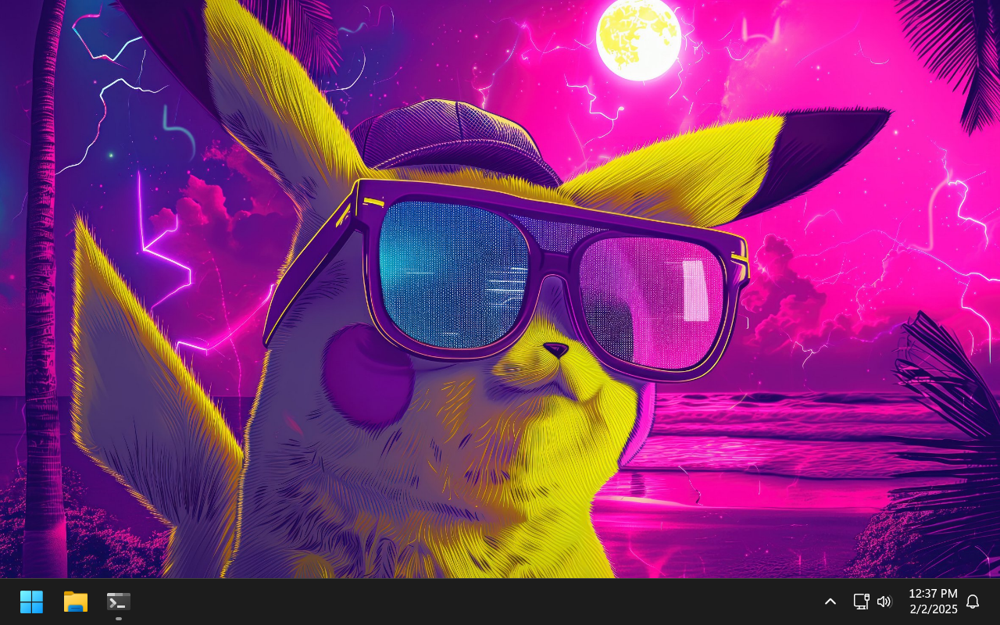

<p align="center">
  <picture>
    <source media="(prefers-color-scheme: dark)" srcset=".assets/icon-dark.png">
    
  </picture>
</p>

<h1 align="center"><samp>GAMHOGEN</samp></h1>

<p align="center">Windows automatic setup for gamers.</p>

<hr>

<h3 align="center">Previews</h3>



<hr>

<h3 align="center">Launch Script</h3>

<p align="center">Blindly executing this is strongly discouraged.</p>

```powershell
$Address = "https://raw.githubusercontent.com/olankens/gamhogen/HEAD/src/Gamhogen.ps1"
$Fetched = New-Item $Env:Temp\Gamhogen.ps1 -F ; Invoke-WebRequest $Address -OutFile $Fetched
Try { Pwsh -Ep Bypass $Fetched } Catch { Powershell -Ep Bypass $Fetched }
```
