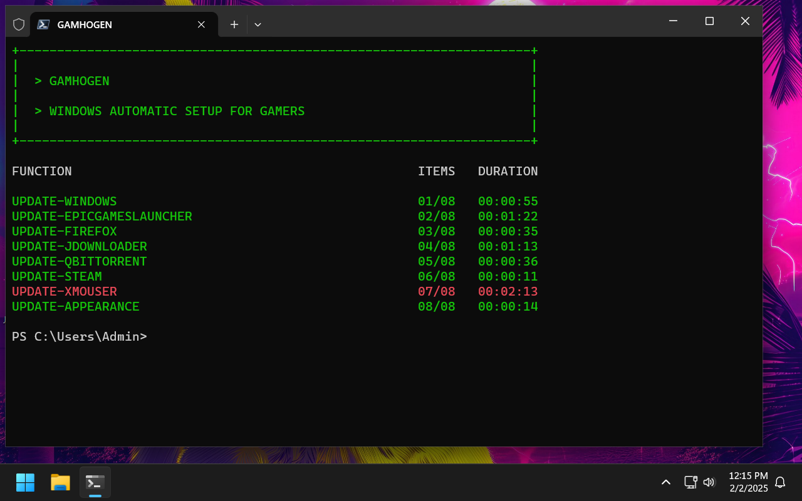
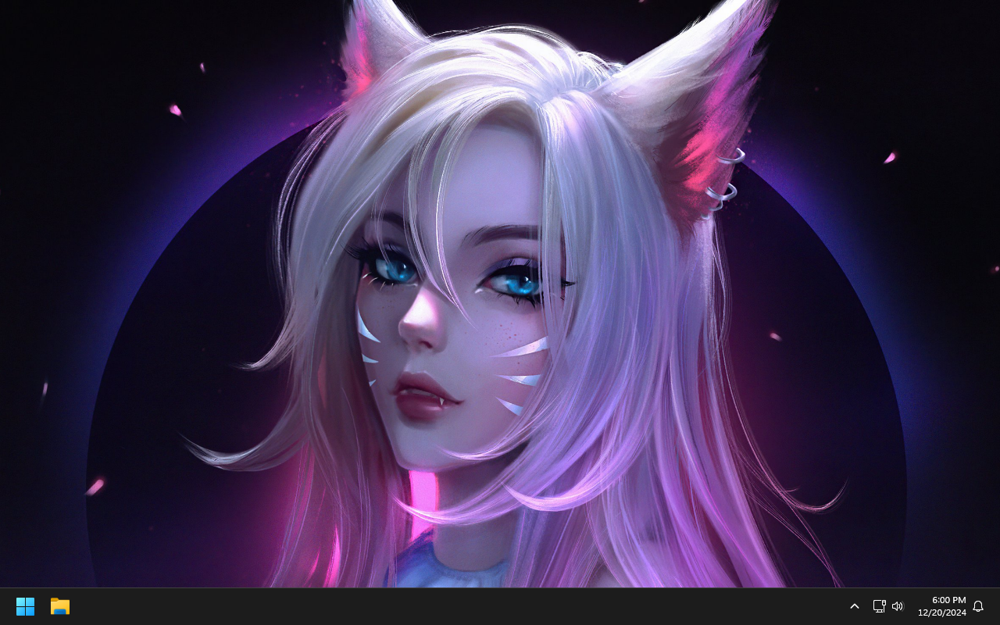

# <samp>OVERVIEW</samp>

Windows automatic setup for gamers.



# <samp>FEATURES</samp>

- Update System
- Update Chromium
- Update Epic Games Launcher
- Update Jdownloader
- Update Qbittorrent
- Update Steam
- Update Xmouser
- Update Appearance

# <samp>GUIDANCE</samp>

### Launch the script

Blindly executing this is strongly discouraged.

```powershell
$Address = "https://raw.githubusercontent.com/olankens/gamhogen/HEAD/src/Gamhogen.ps1"
$Fetched = New-Item $Env:Temp\Gamhogen.ps1 -F ; Invoke-WebRequest $Address -OutFile $Fetched
Try { Pwsh -Ep Bypass $Fetched } Catch { Powershell -Ep Bypass $Fetched }
```
